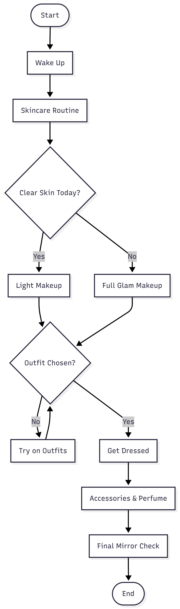

Pattern-Searching Algorithm
===========================

Overview
--------
This project was completed as part of the Codecademy course "Introduction to IT",
under the curriculum section "Software Development Concepts".

The goal of this project is to:

1. Design the logical steps of a pattern-searching algorithm that identifies
   whether a specific value (pattern) exists within a larger dataset.
2. Visualize these steps using a flowchart with standard ANSI flowchart notation:
   - Oval: Start/End
   - Rectangle: Process/Action
   - Diamond: Decision
   - Rhombus: Input/Output
   - Arrows: Control flow
3. Translate the flowchart into pseudocode to clearly communicate the algorithm
   and make it easy to implement in any programming language.

This project demonstrates the ability to present algorithms clearly to both
technical and non-technical audiences, supporting collaboration and
maintainable software development.

Flowchart
---------
The following flowchart illustrates the step-by-step logic of the
pattern-searching algorithm.

The flowchart was created using standard ANSI shapes to show input, processing,
decision points, and output.

You can also view and edit the flowchart online on Mermaid:
https://mermaid.ai/d/48ede00c-9513-465e-be96-1d2335e274a9

Pseudocode
----------
The flowchart can be translated into the following pseudocode:

#define text
#define input pattern
#set match_count to 0

#while there are still elements left to search in text:
    move to the next element
    if the current element matches the pattern:
        increase match_count by 1

#if match_count is greater than 0:
    display that the pattern was found match_count times
#else:
    display that the pattern was not found in the text

Explanation of Steps
--------------------
1. Initialization: define the text to search, the target pattern, and a counter for matches.
2. Iteration: move through each element of the text.
3. Decision: compare each element to the pattern. If a match is found, increment the counter.
4. Output: after searching the entire text, display the number of matches found, or indicate that the pattern was not found.

Key Takeaways
-------------
- Combines visual flowchart design with text-based pseudocode for clarity.
- Helps communicate algorithm logic to audiences of all technical backgrounds.
- Serves as a foundation for implementing the algorithm in any programming language.

